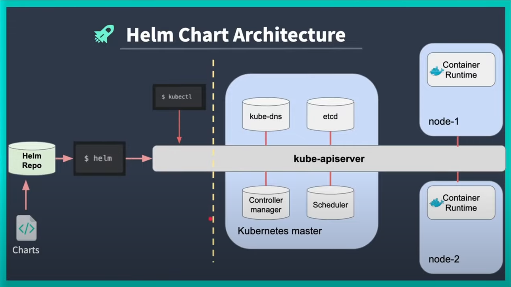

## Helm Chart

<div style="display: flex; flex-direction: column; align-items: center; gap: 20px;">

<div style="display: flex; gap: 10px;">


</div>

<div>

</div>

</div>


Helm is widely known as "the package manager for Kubernetes". 

### Install 

```bash
curl https://raw.githubusercontent.com/helm/helm/main/scripts/get-helm-3 | bash
```

### Helloworld

```bash
helm create helloworld
```